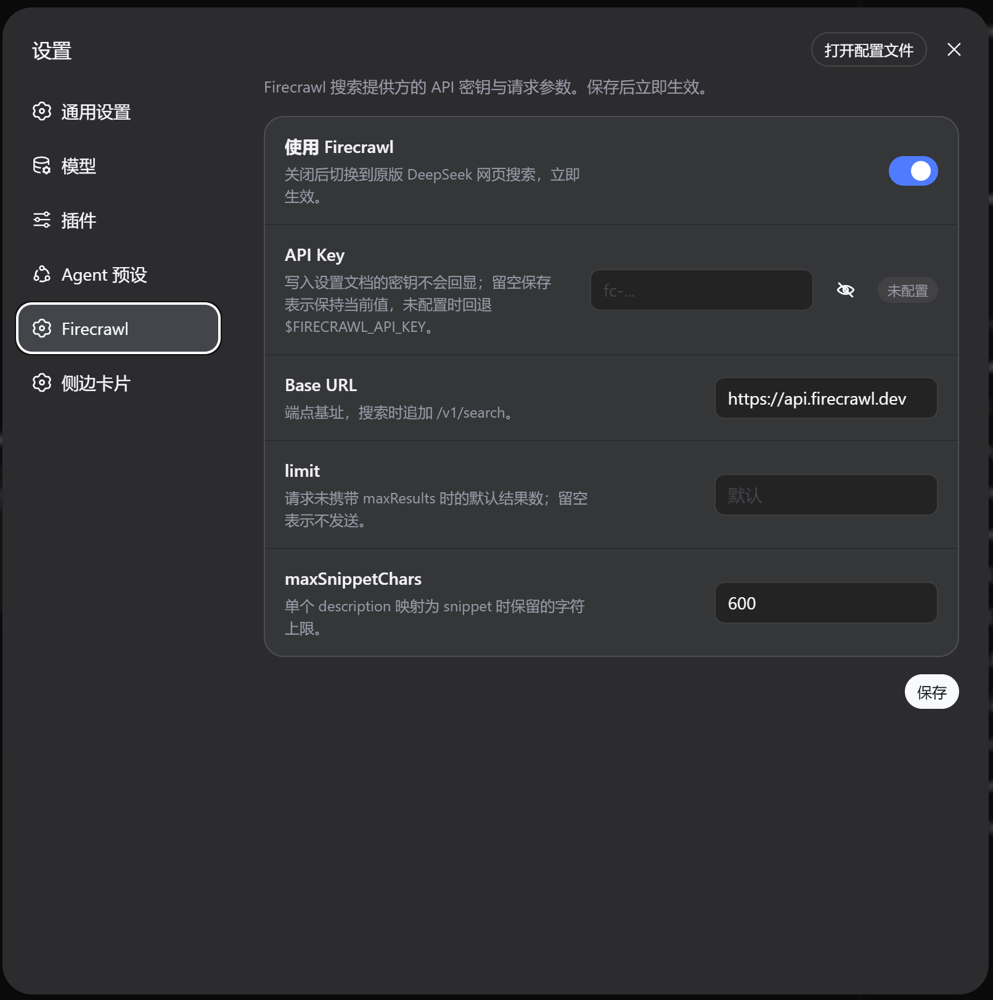

# dsh-web-search-firecrawl

[English](README.md) | 中文



由 [Firecrawl](https://firecrawl.dev) 支持的搜索提供方，用于 [DeepSeek Harness](https://github.com/deepseek-ai/deepseek-harness) 的 web 能力 seam（`ctx.web`）：让内置的 `web_search` 工具走 Firecrawl 搜索 API，而不是随产品附带的 DeepSeek 路由。

本插件是一个 Cordis 函数插件，向 seam 注册 `WebSearchProvider`（`id: firecrawl`）——它不拥有 `ctx.web`，也不注册面向模型的工具（工具 schema 仍属于 `@deepseek-ai/dsh-tool-web`）。它调用 Firecrawl 的 `POST /v1/search` 端点，把扁平 `data[]` 映射为 seam 规范化的 `WebSearchResult`。

API 密钥在 **DSH 设置页的「Firecrawl」页面**中配置；同时保留 `$FIRECRAWL_API_KEY` 作为兼容性回退。

## 环境要求

- DeepSeek Harness 安装在官方包 `0.1.0-rc.6` 线上（本插件 peer 依赖 `@deepseek-ai/dsh-web ^0.1.0-rc.6` 等——当前发布线）。更旧线上 pnpm 会在 profile 中嵌套安装第二份 seam 包，错误分类会降级（跨副本 `WebError`）；可在 profile 目录执行 `npm ls @deepseek-ai/dsh-web` 检查。
- Firecrawl API 密钥。可在 [firecrawl.dev](https://firecrawl.dev) 获取。

## 安装

请从以下两种方式中**二选一**：

**方式一：全局安装的 `dsh` CLI**

```sh
dsh plugin --profile web add @pionai/dsh-web-search-firecrawl@latest
```

**方式二：`deepseek-harness` 源码检出**（那里的 `dsh` 是 pnpm workspace 脚本，而非全局命令；请在 workspace 根目录下运行）

```sh
pnpm dsh plugin --profile web add @pionai/dsh-web-search-firecrawl@latest
```

`dsh plugin` 会在 profile 目录内转发给 pnpm，并自动把 bundle 追加到 profile 的层叠列表。该 bundle patch 插入 `web-search-firecrawl` 插件行，并把 `web` seam 行切换为 `searchProvider: firecrawl`（替换 base bundle 的 `deepseek-official`）。

安装后**重启 `dsh web`**，然后硬刷新页面（Cmd/Ctrl+Shift+R）加载浏览器半的设置页：

```sh
dsh web
```

验证：打开 DSH 设置页应能看到 **Firecrawl** 页面；在会话中让 agent 执行一次网页搜索，请求会走 Firecrawl。密钥缺失时搜索以 `WEB_PROVIDER_CONFIGURED_UNAVAILABLE` 失败。

想保留 DeepSeek 搜索为默认、仅按实例启用 Firecrawl：在你自己的 profile `cordis.patch.yml` 中改写 `web` 行即可——每行最后一次写入生效。base bundle 固定了 `searchProvider: deepseek-official`，因此 `$DSH_WEB_SEARCH_PROVIDER` 只在 `web` 行未设置 `searchProvider` 时生效：用环境变量选择时把 `web` 行改写为空 config（`- id: web` + `config: {}`），要固定 DeepSeek 则写 `searchProvider: deepseek-official`。

## 更新插件

全局安装的 `dsh` CLI：

```sh
dsh plugin --profile web update --latest @pionai/dsh-web-search-firecrawl
```

`deepseek-harness` 源码检出（请在 workspace 根目录下运行）：

```sh
pnpm dsh plugin --profile web update --latest @pionai/dsh-web-search-firecrawl
```

`dsh plugin update` 会在 profile 目录内转发给 pnpm；`--latest` 表示升级到 npm 上的最新版本，不受当前已安装版本范围限制。更新后请**重启 `dsh web`**，并硬刷新页面（Cmd/Ctrl+Shift+R）。如果插件安装在其他 profile 中，请把 `web` 替换为对应的 profile 名。

## 卸载

全局安装的 `dsh` CLI：

```sh
dsh plugin --profile web remove @pionai/dsh-web-search-firecrawl
```

`deepseek-harness` 源码检出（请在 workspace 根目录下运行）：

```sh
pnpm dsh plugin --profile web remove @pionai/dsh-web-search-firecrawl
```

`dsh plugin remove` 会在 profile 目录内转发给 pnpm，并自动把包从 `dsh.profile.bundles` 移除。bundle 层移除后，`web` seam 行会恢复为 base bundle 的 `deepseek-official`。卸载后需**重启 `dsh web`**，运行中的进程才会停止加载该插件。

该命令只移除包与挂载，不会删除设置页已保存的值；若希望一并删除已保存的 API Key，请先在 **Firecrawl** 页面点击「清除」。如果插件安装在其他 profile 中，请把 `web` 替换为对应的 profile 名。

## 切换搜索提供方

安装本插件后，`web` seam 的 `searchProvider` 会切到 `firecrawl`，因此默认会替换原版网页搜索。打开 **DSH 设置 → Firecrawl** 后，页面顶部的「**使用 Firecrawl**」开关可以在两者之间实时切换：

- **开（默认）**：使用 Firecrawl `POST /v1/search`。
- **关**：`firecrawl` provider 会把请求委托给原版 DeepSeek 搜索实现，模型继续走随产品附带的 DeepSeek 搜索路由；DeepSeek 的端点、模型等仍从原版的 `web-search-deepseek` 设置段解析。

切换立即生效，无需重启；Firecrawl 的 API Key 和请求参数在关闭时保留，下次打开开关继续使用。

## 配置 API 密钥

打开 **DSH 设置 → Firecrawl**：

1. 在 **API Key** 输入框粘贴 `fc-...`，点击保存。输入框旁的眼睛按钮可在当前输入过程中切换明文显示/隐藏。
2. 密钥以 `role('secret')` 写入设置文档：任何接口响应都不会回显已保存的字面值，页面只显示「已配置 / 未配置」。
3. **留空保存表示保持当前密钥**；点击「清除」可删除已保存的密钥。
4. 保存后**立即生效**：已注册的 provider 会在下一次搜索使用新配置，无需重启。

如果没有在设置页填写密钥，插件仍按兼容方式回退到 `$FIRECRAWL_API_KEY`：

```sh
export FIRECRAWL_API_KEY=fc-...
dsh --profile web
```

## 配置

| 配置键 | 默认值 | 含义 |
|---|---|---|
| `useFirecrawl` | `true` | 是否使用 Firecrawl；`false` 时切换到原版 DeepSeek 网页搜索。 |
| `apiKey` | （空）→ `$FIRECRAWL_API_KEY` | Firecrawl API 密钥。设置页写入的 secret 不回显；为空时回退环境变量。两者都缺失时提供方不可用。 |
| `baseURL` | `https://api.firecrawl.dev` | 端点基址；追加 `/v1/search`。无法解析时提供方不可用。 |
| `limit` | （未设置） | 请求不含 `maxResults` 时使用的默认结果数。留空时不发送默认值。必须是正整数。 |
| `maxSnippetChars` | `600` | 将单个 `description` 映射为 `snippet` 时保留的字符上限。必须是正整数。 |

所有字段都可以在设置页修改。插件 bundle 配置仍然是「base 层」：设置页用户层叠加其上，因此 profile 中可以只写需要固定的字段：

```yaml
# profile cordis.patch.yml（可选，通常无需配置）
- id: web-search-firecrawl
  name: '@pionai/dsh-web-search-firecrawl'
  config:
    limit: 10
```

## 映射

Firecrawl 返回扁平 `data[]`，不返回生成答案，因此省略 `content`。每项条目映射为 `WebSearchSource`：`url` ← `url`、`title` ← `title`、`snippet` ← 修剪并按 `maxSnippetChars` 限长的 `description`（没有非空 description 的条目仍保留可引用的仅 URL 来源）。请求的 `maxResults` 优先于已配置的默认 `limit`，并作为 Firecrawl `limit` 发送，以优化成本和延迟；最终上限由 seam 强制执行。提供方失败（HTTP 错误、网络失败、响应体无法解析或结构不符、`success: false` 信封）以 `WebError` `WEB_PROVIDER_ERROR` 呈现；中止请求以 `WEB_ABORTED` 呈现。HTTP 重定向会在访问 `Location` 指向的目标之前被拒绝。

## 模型体验

通过 `@deepseek-ai/dsh-tool-web` 间接影响：模型看到经 `maxResults` 限制的 URL、标题与限长后的描述，以及消费方错误包装层内的 `Firecrawl search aborted`、`Firecrawl search request failed: <error>` 和 `Firecrawl returned an unprocessable response body: <error>`。生成答案与提供方私有字段不进入上下文。

## 已知限制

- **snippet 是 Firecrawl 的 `description` 摘录，而非搜索引擎摘要**：可能是较长的页面 markdown，因此提供方将其限制为 `maxSnippetChars`；没有 description 的条目完全不带 snippet（仅 URL）。
- **只公开 `limit`／`maxSnippetChars`**：Firecrawl 的其他控制项（语言、国家／地区、时效、位置、定向、抓取选项）等待 `@deepseek-ai/dsh-web` 中提供方无关的 Service Definition 字段。
- **按错误形状分类中止**：只有 `DOMException` 且名为 `AbortError` 时才映射为 `WEB_ABORTED`；携带自定义原因的中止会呈现为 `WEB_PROVIDER_ERROR`。

## 开发

```sh
pnpm install
pnpm run typecheck
pnpm test                            # 单元测试（不联网）
FIRECRAWL_API_KEY=... pnpm run test:e2e  # 真实 API 冒烟，无密钥时自动跳过
pnpm run build                       # 产出 lib/（ESM host）+ lib/client.js（浏览器半）+ lib/types/（d.ts）
```

## 许可证

MIT
